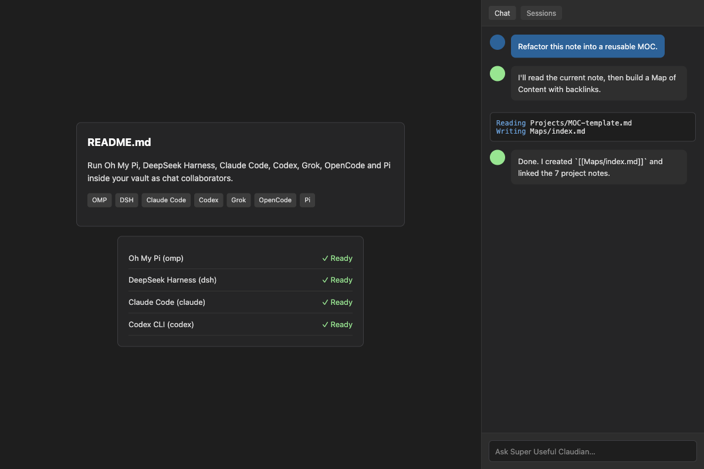

# Super Useful Claudian

Run Oh My Pi, DeepSeek Harness, Claude Code, Codex, Grok, OpenCode and Pi inside your vault as
chat collaborators, with provider readiness checks, a capability matrix and a token usage meter.

An independent fork of [Claudian](https://github.com/YishenTu/claudian) by Yishen Tu.
It keeps everything Claudian already does — chat tabs, inline editing, session manager,
Zen mode, dual pane, side chat, agent skills, turn steering, subagent history — and adds
extra agent harnesses plus a few enhancements borrowed from
[oh-my-claudian](https://github.com/lee259/oh-my-claudian) by Lee.

Both upstream projects are MIT licensed; see NOTICE.md and LICENSE.




## Requirements

- Obsidian v1.13.0+
- Desktop only (macOS, Linux, Windows)
- At least one agent CLI installed locally, plus whatever subscription or API access that CLI needs

## Supported providers

Each provider is a locally installed agent CLI. The plugin drives it as a subprocess;
nothing is bundled and nothing is downloaded for you.

| Provider | CLI | Notes |
|---|---|---|
| Claude Code | `claude` | `@anthropic-ai/claude-code` |
| Codex CLI | `codex` | `@openai/codex` |
| Grok Build | `grok` | speaks ACP |
| OpenCode | `opencode` | speaks ACP |
| Pi | `pi` | `@earendil-works/pi-coding-agent` |
| **Oh My Pi (OMP)** | `omp` | `@oh-my-pi/pi-coding-agent` — install with the omp.sh install script |
| **DeepSeek Harness** | `dsh` | `@deepseek-ai/dsh` — needs Node.js and a DeepSeek API key |

Providers can also be pointed at other model backends through their own configuration
(for example running Claude Code against a non-Anthropic endpoint), which is covered by
that CLI's own documentation.

## What this fork adds over upstream Claudian

- **Two extra agent harnesses**: Oh My Pi (OMP) and DeepSeek Harness.
- **Provider readiness panel** at the top of every provider's settings tab: is it enabled,
  is the CLI installed and which version, was a model catalog discovered, is a model
  selected — each with a hint on what to do next. Install and update commands are shown for
  you to copy; the plugin never runs them.
- **Provider capability matrix**: which harness supports images, forking, rewind, turn
  steering, plan approval, instruction mode, provider commands and reasoning control, read
  live from the providers rather than from a table that can go stale.
- **Token usage meter**: per-turn consumption recorded locally and shown by day and by
  session, in Settings, General.
- **Instruction mode** (opt-in): type `#` in an empty composer and a rough instruction is
  rewritten into a proper prompt, asking a clarifying question first when it needs one.
- **Inline plan approval**: where a provider reports plan mode, exiting it renders a card
  you can approve or reject.
- **Composer bash mode** (opt-in): type `!` to run a shell command and see its output in the
  transcript.

## Disclosures

Required by the Obsidian developer policies, and true as of this fork:

- **Network use.** By default the plugin itself makes no network requests. The agent CLIs
  it launches do: they talk to their own model providers (Anthropic, OpenAI, xAI, DeepSeek,
  …) and to any MCP servers you configure. Which services are contacted, and with which
  credentials, is determined by those CLIs and by the environment variables you set in each
  provider's settings.
  There is exactly one optional exception: if you turn on **Check for CLI updates**, the
  plugin queries `https://registry.npmjs.org` (public npm registry, no identifiers sent
  beyond the package names) to tell you when an installed CLI has a newer release. It is
  off by default and can be turned off again at any time.
- **Files outside the vault.** Each agent CLI is started with your vault as its working
  directory, but the CLIs may read and write outside it (their own config, credentials,
  session stores and caches; OMP uses `~/.omp`, Pi uses `~/.pi`, DeepSeek Harness uses
  `~/.dsh`). Session metadata is kept inside the vault under the plugin's own folder.
- **Running commands.** The optional composer bash mode runs shell commands you type
  yourself, in your vault, through your own shell — the same thing you could do in a
  terminal. It is off by default; output is capped at 1 MiB and commands are killed
  after 30 seconds. Nothing here is model-driven: it only runs what you type after `!`.
- **What is stored locally.** The plugin keeps its settings, session metadata and token
  usage log inside your vault, under `.super-useful-claudian/`. The usage log records, per turn, the
  conversation id, provider, model and token counts — never message content — and is
  trimmed to 90 days. Nothing is uploaded anywhere by the plugin itself.
- **Paid services.** Some providers require a paid subscription or API key. The plugin
  does not sell anything and does not install or update any CLI for you.
- **Desktop only.** `isDesktopOnly` is true: the plugin spawns subprocesses through Node
  APIs and cannot work on mobile.

## Installing

Not in the community directory — this is a fork, and Obsidian's developer policies require
explicit permission from the original author before a fork may be listed there
(https://docs.obsidian.md/community-directory/developer-policies). Until that is sorted
out, install it manually or via BRAT:

1. Download `main.js`, `manifest.json` and `styles.css` from the latest release.
2. Put them in `YOUR_VAULT/.obsidian/plugins/super-useful-claudian/`.
3. Enable **Super Useful Claudian** in Settings, Community plugins.

This fork registers its own view type and keeps its own `.super-useful-claudian/` storage, so it can
sit next to upstream **Claudian** without either one registering the same view or
overwriting the other's settings. Install whichever you want to use.

## Building

```sh
npm ci
npm run build      # produces main.js and styles.css in the repository root
```

Requires Node.js 24.x. `npm run test:unit` runs the unit suite; `npm run typecheck` and
`npm run lint` are also wired up.

## Configuration

Settings live in `.super-useful-claudian/` inside your vault. The plugin stores its settings file,
session metadata and cached catalogs there — separate from upstream Claudian, which uses
`.claudian/`, so the two can coexist on disk without corrupting each other.

## Credits

- [Claudian](https://github.com/YishenTu/claudian) — Yishen Tu (MIT). The architecture,
  the provider framework, the chat UI and most provider implementations are theirs.
- [oh-my-claudian](https://github.com/lee259/oh-my-claudian) — Lee (MIT). Several
  enhancements in this fork were ported from it, and it was the reference for the OMP and
  DeepSeek Harness providers.
